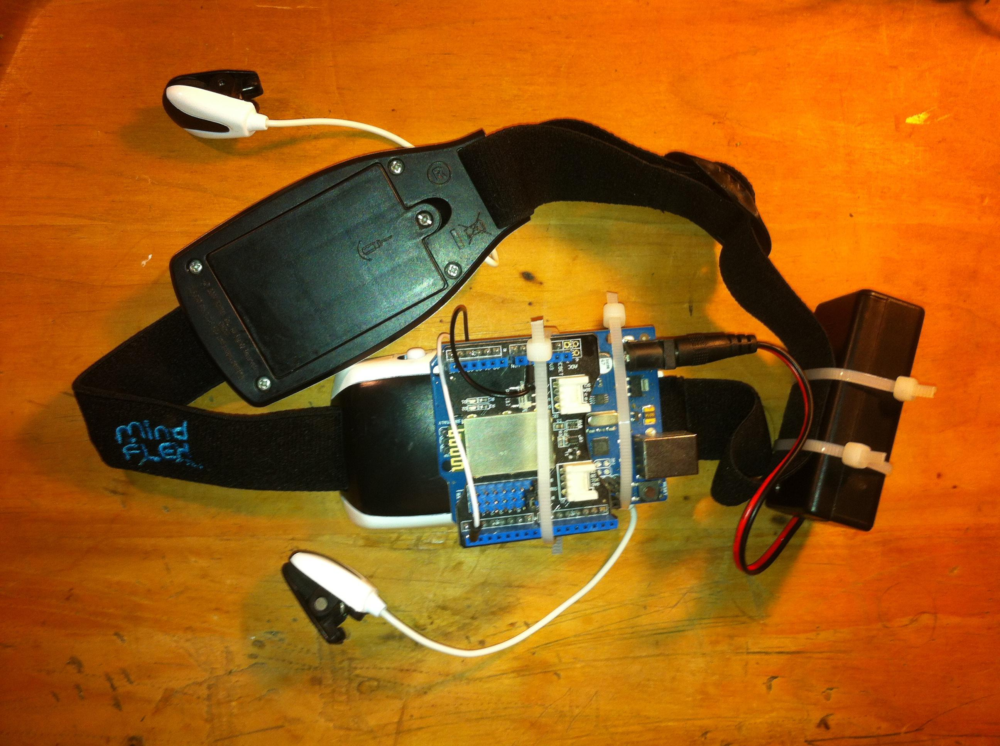

# Proof of Concept: Mind-Controlled Quadcopter Drone #

This project utilized a Bluetooth-enabled Arduino EEG, made from a hacked Neurosky headband originally included in the Mindflex game by Mattel. It was a spinoff from an earlier [visualization project](https://github.com/wobkat/mind-controlled-cellular-automata) I implemented using the same hardware. This project functioned similarly to the previous one in that the Arduino EEG sent brain data to [Processing](https://processing.org) through a [“Seeeduino” Bluetooth Shield](http://wiki.seeedstudio.com/wiki/Bluetooth_Shield), but instead of changing a visualization it controlled the takeoff and landing of an AR Parrot Quadcopter drone.

This project adapted code from:

[Open Drone Control](https://github.com/opendronecontrol/odc) -- for controlling the AR Parrot Quadcopter

[BrainGrapher](https://github.com/kitschpatrol/BrainGrapher) -- for the Processing side of reading the EEG data from the serial port

[Arduino EEG Library](https://github.com/kitschpatrol/Brain) -- for collecting the EEG data with an Arduino

According to the original work documented on [this page](http://www.frontiernerds.com/brain-hack), the researchers `confirmed that the status lights and ball-levitating fan in the Mind Flex are simply mapped to the “Attention” value coming out of the NeuroSky [EEG] chip.`

Using this knowledge, I merely applied the same methodology for this project. An "Attention" value above a specific threshold makes a call to the Open Drone Control library's `drone.takeOff()` method. An "Attention" value below that threshold makes a call to the `drone.land()` function.

If I hadn't become busy with other endeavors, I would've tried to procure a gaggle of drones, written some relatively clever rules, and used the Arduino EEG's additional values (`signal strength, meditation, delta, theta, low alpha, high alpha, low beta, high beta, low gamma, and high gamma`) to orchestrate a loosely synchronized yet wholly unpredictable quadcopter sock hop. But alas, there is not enough time to do all the nothing we want to do.

Nevertheless. Our greatest glory is not in never falling, but in rising every time we fall. 

For more information on the hardware hack and data structure, please refer to the following link:

[Arduino EEG "Brain Hack" Documentation](http://www.frontiernerds.com/brain-hack)

